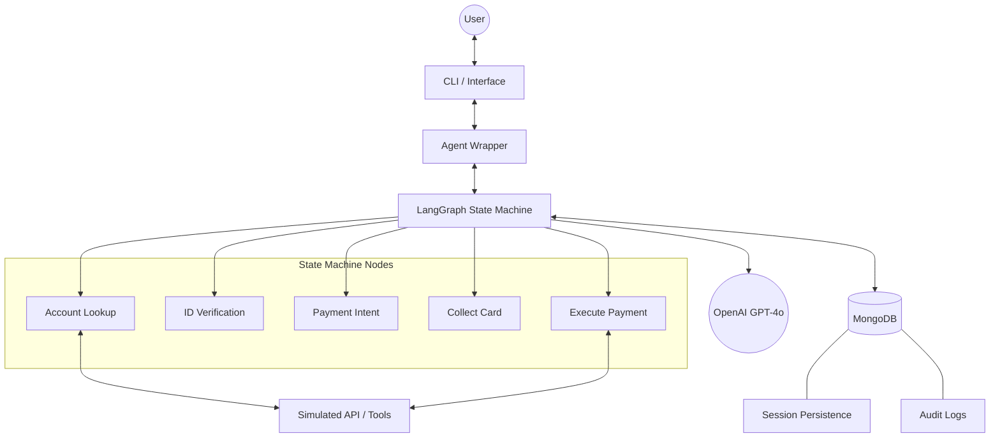

# 🏗️ System Architecture

This document provides a detailed overview of the technical architecture of the **Payment Collection AI Agent**.

## 📍 System Overview

The agent is built as a stateful, conversational system designed to handle sensitive financial transactions. It leverages **LangGraph** to manage the conversation flow as a directed graph, ensuring deterministic transitions while using **LLMs** for natural language understanding and information extraction.

---

## 🧩 Core Components

### 1. 🧠 Orchestration (LangGraph)
The core logic resides in a state machine defined in `src/agent.py`. The graph consists of nodes representing specific phases of the payment flow and edges representing transitions based on the current state.

#### Nodes:
- **`greeting_and_account`**: Greets the user and extracts the Account ID.
- **`account_lookup`**: Fetches account details from the simulated API.
- **`collect_name`**: Gathers the user's full name for verification.
- **`collect_secondary_factor`**: Collects DOB, Aadhaar Last 4, or Pincode and performs identity verification.
- **`payment_decision`**: Determines if the user wants to pay full, partial, or decline.
- **`collect_card_details`**: Securely gathers PCI-sensitive information.
- **`process_payment_node`**: Executes the transaction via the payment API.
- **`recap_and_close`**: Provides a summary and ends the session.
- **`closed`**: A terminal state for locked or finished sessions.

### 2. 📝 State Management (`src/state.py`)
The `AgentState` is a `TypedDict` that tracks the entire lifecycle of a session:
- **`messages`**: Full conversation history (with `add_messages` annotation).
- **`account_data`**: Cached data from the lookup API.
- **`verified`**: Boolean flag for identity status.
- **`payment_amount`**: The amount intended to be paid.
- **`card_details`**: Dictionary containing (masked/scrubbed) card information.
- **`transaction_id`**: Reference for successful payments.

### 3. 🤖 LLM Extraction (`src/nodes.py`)
Nodes use **Pydantic** models with `ChatOpenAI.with_structured_output()` to extract entities from user messages:
- `AccountIDExtraction`
- `NameExtraction`
- `SecondaryFactorExtraction`
- `PaymentDecision`
- `CardDetailsExtraction`

---

## 🔄 Data Flow

1.  **Input**: User sends a message via CLI/Frontend.
2.  **Sanitization**: Input is scrubbed for excessive length and basic injection patterns.
3.  **Graph Invocation**: The graph is invoked with the current state and session ID.
4.  **Routing**: `determine_next_node` evaluates the state to decide which node to run next.
5.  **Processing**: The active node uses an LLM to extract data or calls a tool (API).
6.  **Update**: State is updated, and the AI response is appended to `messages`.
7.  **Scrubbing**: If sensitive data (PCI) is present, the state is scrubbed before being saved.
8.  **Output**: The AI message is returned to the user.

---

## 🛡️ Security & Compliance

### PCI-DSS Compliance
- **Real-time Scrubbing**: The `scrub_pci_from_messages` utility removes full card numbers from the message history before persistence.
- **Masking**: Card numbers are never stored in full. Only `card_last4` is retained for the recap node.
- **Transient Memory**: Card CVV and full numbers are held in memory only during the `process_payment` execution and cleared immediately after.

### Identity Verification (MFA)
- The agent requires a two-factor verification:
    1.  **Something you know**: Full Name.
    2.  **Secondary Factor**: DOB, Aadhaar Last 4, or Pincode.
- **Lockout Mechanism**: Exceeding 3 failed verification attempts transitions the state to `closed` and locks the session.

---

## 💾 Persistence Layer

### MongoDB Integration
- **Checkpointer**: `SecureMongoDBSaver` (in `src/checkpointer.py`) saves the graph state to a `checkpoints` collection. This allows session resumption across different client instances.
- **Audit Logger**: `AuditLogger` (in `src/audit.py`) records critical events (starts, verification results, payment outcomes) to an `audit_logs` collection for legal and compliance tracking.

### Graceful Fallback
If MongoDB is unavailable, the system automatically falls back to an in-memory `MemorySaver`, ensuring functionality while logging a warning.

---

## 🧪 Evaluation Framework
The system includes a specialized `evaluate.py` that runs the agent against 17 distinct scenarios, including:
- Partial payments
- Wrong SSN/DOB retries
- Invalid card numbers
- Account not found
- Session lockout logic

---

## 📊 Component Diagram (Conceptual)

